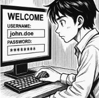

# Tasca 01: Gestió de Contrasenyes Segures

## Descripció General

Aquesta tasca forma part del projecte 3 i té com a objectiu abordar la seguretat de les contrasenyes dins de l’empresa EverPia, després d’un incident de filtració d’informació confidencial.

L’escenari plantejat és el següent: la consultora on treballa l’alumne ha patit un atac informàtic que ha exposat informació sensible, principalment a causa de l’ús de contrasenyes febles o repetides en comptes tècnics. Com a resposta, la Direcció Tècnica ha decidit implementar l’ús obligatori d’un **gestor de contrasenyes** per tot el personal tècnic.

## Objectius de la Tasca

La tasca es divideix en dues fases principals:

### Fase 1: Anàlisi i Justificació
- Explicar per què les contrasenyes febles o reutilitzades representen un risc crític per a l’empresa.
- Presentar els avantatges de l’ús d’un gestor de contrasenyes per minimitzar aquests riscos.
- Fer una comparativa tècnica entre dues opcions de gestors de contrasenyes:
  - **Bitwarden** (solució en línia / núvol)
  - **KeePassXC** (solució offline / escriptori)
- Resumir avantatges i inconvenients de cada opció.
- Donar una recomanació sobre quina eina és més adequada per l’equip tècnic.

### Fase 2: Guia d’Ús Tècnica
- Crear una guia pràctica i visual per a l’equip tècnic.
- Explicar com instal·lar i configurar l’eina seleccionada.
- Mostrar com generar contrasenyes segures.
- Donar exemples d’ús, com desar credencials de correu electrònic o aplicacions web i utilitzar l’emplenament automàtic.
- Indicar com gestionar còpies de seguretat de manera segura.

## Entregables
Els arxius han d’estar dins la carpeta `tasca01` del repositori del projecte-3:

- `README.md` → Breu descripció de la tasca i enllaços als altres arxius.
- `informe.md` → Conté la fase 1 (anàlisi i comparativa tècnica).
- `guia.md` → Conté la fase 2 (guia pràctica per a l’equip tècnic).
- Carpeta `img/` amb les captures de pantalla utilitzades a la guia.

---

Aquesta tasca té com a objectiu principal **millorar la seguretat i la gestió de les contrasenyes de l’equip tècnic** i proporcionar documentació clara i pràctica per a la seva aplicació.

