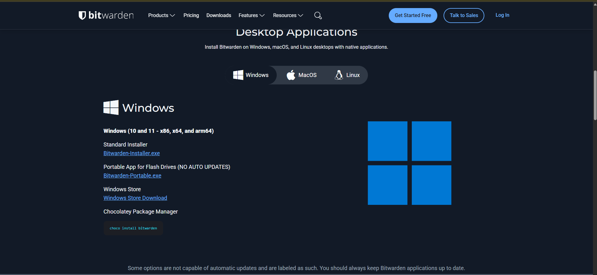
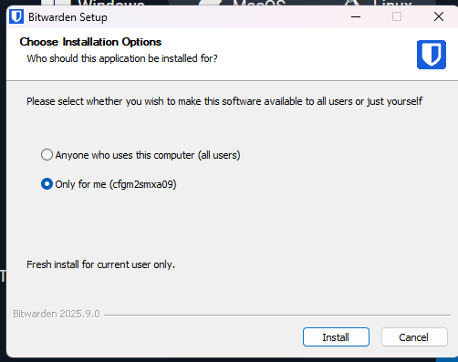
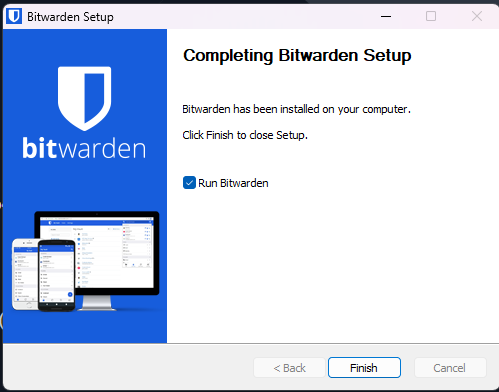
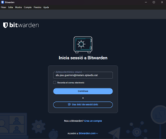
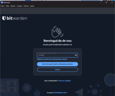
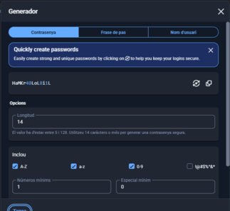

# GUIA T01
## INSTAL.LACIÓ I CONFIGURACIÓ
Per instal·lar Bitwarden, anem a Google i entrem a la pàgina oficial de Bitwarden.  
Allà descarregarem la versió corresponent.

Un cop descarregat, seguirem els passos de la instal·lació fins acabar el procés.

 

Ara ja podem crear un compte a Bitwarden introduint les nostres dades i escollint una contrasenya segura.

 

## GENERACIÓ DE CONTRASENYAS
Per generar una contrasenya anirem a la aplicació y en les opcions de adalt anirem a mostra i generador y en alla ja estarem dins del generador de contrasenya.

Per fer una contrasenya segura a Bitwarden, obre el generador a l’app o al navegador.
Tria una longitud llarga i activa majúscules, números i símbols.
Evita paraules fàcils de recordar o comunes, que els hackers endevinen ràpid.
Cliquem generar i guarda-la directament al compte que estàs creant.

## EXEMPLE D'ÚS I EMPLENAMENT AUTOMÀTIC
