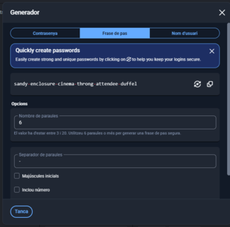
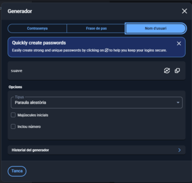

per instal.lar bitwarden anem a google y entrem a la pagina oficial de bitwarden, en alla la descargarem 

En alla seguirem els pasos de la instalacio

Ara crearem una conta a bitwarden

 

# GENERACIÓ DE CONTRASENYAS
Per generar una contrasenya anirem a la aplicació y en les opcions de adalt anirem a mostra i generador y en alla ja estarem dins del generador de contrasenya.

  
