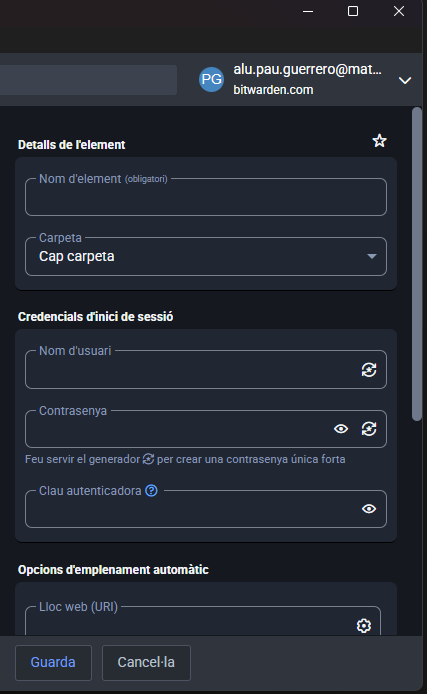
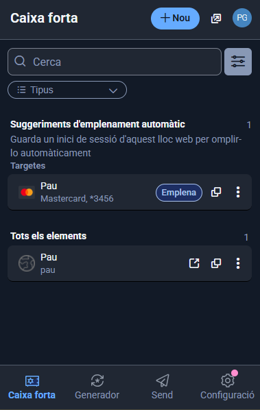
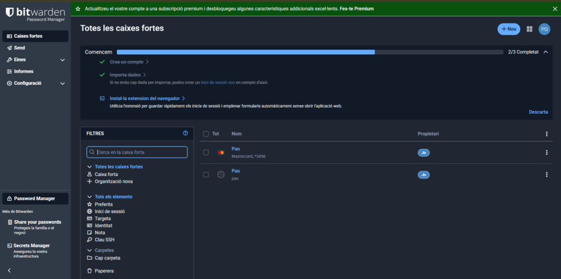
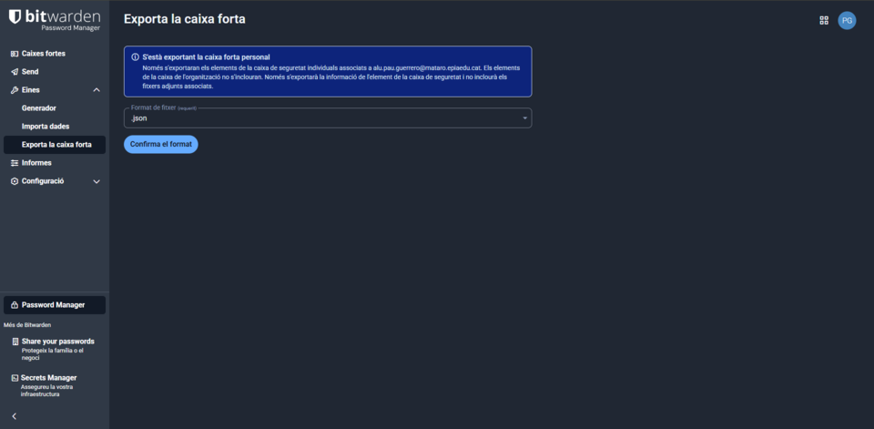

# GUIA T01
## INSTAL.LACIÓ I CONFIGURACIÓ
Per instal·lar Bitwarden, anem a Google i entrem a la pàgina oficial de Bitwarden.  
Allà descarregarem la versió corresponent.

Un cop descarregat, seguirem els passos de la instal·lació fins acabar el procés.

 

Ara ja podem crear un compte a Bitwarden introduint les nostres dades i escollint una contrasenya segura.

 

## GENERACIÓ DE CONTRASENYAS
Per generar una contrasenya anirem a la aplicació y en les opcions de adalt anirem a mostra i generador y en alla ja estarem dins del generador de contrasenya.

Per fer una contrasenya segura a Bitwarden, obre el generador a l’app o al navegador.
Tria una longitud llarga i activa majúscules, números i símbols.
Evita paraules fàcils de recordar o comunes, que els hackers endevinen ràpid.
Cliquem generar i guarda-la directament al compte que estàs creant.

## EXEMPLE D'ÚS I EMPLENAMENT AUTOMÀTIC
Per desa una credencial d'un compte de correu electronic em de anar al més (+) que hi ha abaix, i entre les opcions elegir inicia sesió i en alla ompli les nostres dades

-

Per utilitzar l’extensió de Bitwarden al navegador, primer instal·la-la i inicia sessió amb el teu compte mestre.
Quan accedeixis a una web, fes clic a la icona de Bitwarden a la barra del navegador.
Selecciona la credencial corresponent del menú que apareix.
Bitwarden emplenarà automàticament l’usuari i la contrasenya al formulari.

## GESTIÓ DE COPIES DE SEGURETAT
Per fer una còpia de seguretat de les nostres contrasenyes, primer hem d’accedir a la web de Bitwarden i iniciar sessió amb el nostre compte.  
Un cop dins, hem d’anar a la secció Eines.  
Dins d’Eines, seleccionarem l’opció Exporta la bústia, que ens permet descarregar totes les credencials.  

 

La millor pràctica és guardar la còpia de seguretat de les contrasenyes en un lloc totalment segur.  
Es recomana utilitzar un USB xifrat o un servei de núvol amb xifratge, assegurant que només tu tinguis accés a la contrasenya mestre.  
D’aquesta manera, encara que el dispositiu o el núvol es perdi o sigui hackejat, les teves contrasenyes continuaran protegides.  
Sempre és important no deixar la còpia de seguretat desprotegida ni compartir-la amb altres persones.
