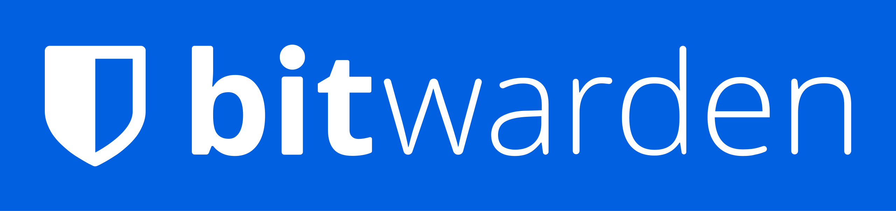

# INFOMRE

## Introducció i Justificació
- Les contrasenyes febles o repetides són perilloses perquè els hackers poden endevinar-les fàcilment o provar-les en diferents comptes. Això pot donar accés a informació confidencial de l’empresa i provocar filtracions greus.

- Un gestor de contrasenyes ajuda a crear i guardar contrasenyes fortes i úniques per a cada compte, evitant que els hackers puguin accedir fàcilment a la informació de l’empresa.

## Comparativa Tècnica
| Característica              | **Bitwarden** | **KeePassXC** |
|-----------------------------|---------------|---------------|
| **Sincronització**          | Sincronització automàtica al núvol entre dispositius. | No té sincronització automàtica; requereix còpies manuals del fitxer .kdbx entre dispositius. |
| **Model de seguretat**      | Xifratge de punta a punta amb AES-256 i arquitectura de coneixement nul. | Emmagatzematge local xifrat amb AES-256; el fitxer .kdbx es pot emmagatzemar en qualsevol ubicació, també a núvols privats. |
| **Accés des de múltiples dispositius** | Accés fàcil des de qualsevol dispositiu amb connexió a Internet. | Accés des de dispositius locals mitjançant el fitxer .kdbx, no requereix connexió a Internet. |
| **Cost / Model freemium**   | Pla gratuït amb funcions bàsiques; pla Premium per 10 $/any amb funcions addicionals. | Gratuït, no hi ha versió Premium. |

 

### KeePassX / KeePassXC
### Emmagatzematge local de l'arxiu (KDBX)
KeePassXC guarda totes les contrasenyes en un fitxer local amb extensió .kdbx. Aquest fitxer està xifrat amb AES-256, garantint la seguretat de la informació. Només es necessita aquest fitxer i la contrasenya mestre per accedir a les credencials. Tot queda al teu ordinador sense dependre de cap servidor extern.

### Independència del núvol
KeePassXC no necessita connexió a Internet per funcionar, ja que les contrasenyes es guarden localment. Això evita que la informació es pugui filtrar des de servidors en línia. Cada usuari controla completament on es desa el fitxer .kdbx, reduint els riscos associats a serveis externs. La independència del núvol aporta més seguretat i control a l’usuari.

### Model open source
KeePassXC és de codi obert, la qual cosa permet que qualsevol pugui revisar i auditar el seu codi. Això aporta més transparència i confiança en la seguretat del programa. Qualsevol desenvolupador pot contribuir a millorar-lo o detectar errors de seguretat, cosa que reforça la fiabilitat de l’eina. A més, no depèn d’una empresa per mantenir-lo ni de llicències de pagament.

### Portabilitat de l'arxiu
El fitxer .kdbx es pot copiar fàcilment a USB o altres dispositius, permetent portar les contrasenyes a diferents ordinadors sense necessitat de sincronització. També es pot emmagatzemar en serveis de núvol xifrats, mantenint la seguretat. Aquesta flexibilitat facilita treballar en diversos entorns i llocs. La portabilitat fa que KeePassXC sigui molt pràctic i adaptable a les necessitats de l’usuari.

## Avantatges i Inconvenients
### Seguretat
Els gestors online com Bitwarden ofereixen xifratge de punta a punta i còpies automàtiques al núvol, però depenen d’Internet i d’un servidor extern.  
Els gestors offline com KeePassXC guarden les contrasenyes al teu dispositiu, donant més control i privacitat, però requereixen fer les còpies de seguretat manualment.

### Usabilitat
Els gestors **online** són més còmodes, ja que permeten accedir fàcilment des de qualsevol dispositiu i sincronitzar tot automàticament.  
En canvi, els gestors offline necessiten moure el fitxer manualment entre dispositius, cosa que pot ser menys pràctica per a l’usuari.

### Continuïtat del negoci
Els gestors online asseguren que el personal pugui recuperar l’accés ràpidament en cas de pèrdua d’un dispositiu, gràcies a la sincronització al núvol.  
Els gestors offline, en canvi, depenen de les còpies locals; si es perd el fitxer o no es fan còpies, es poden perdre totes les contrasenyes.

## Recomanació
Penso que Bitwarden és l'opció més adequada per a l'equip tècnic de l'organització.
Dona seguretat, conveniència i usabilitat. La sincronització automàtica entre dispositius fa que en qualsevol lloc no hi hagui risc de perdre informació.
La seva encriptació d'extrem a extrem assegura la protecció de les contrasenyes i minimitza la possibilitat d'errors dels usuaris.
Per aquestes raons, Bitwarden és la selecció més adequada per assegurar la protecció i eficàcia a l'empresa.

 
