# Part Linux: LVM amb Zorin OS
S'ha d'utilitzar la distribució Zorin OS (o una alternativa Linux compatible) per demostrar la utilitat del Logical Volume Manager (LVM).
Requisits de la Implementació i Demostració:

- Configuració Inicial: Crear un grup de volums (VG) i un volum lògic (LV) utilitzant inicialment un mínim de dos discs durs (simulats) de 10 GB de capacitat. Aquest volum haurà estar formatat i muntat automàticament al sistema mitjançant l’edició de l’arxiu /etc/fstab.
  
- Alta Disponibilitat: Implementar la configuració d’un mirall (lvm_mirror) que protegeixi la informació davant la fallada d'un disc.
  
- Instantànies (snapshots):  Crear i afegir dos discos de 10 GB al grup de volums. Crear un volum (lvm_dades) amb el primer disc afegit, formatar-lo i muntar-lo. A continuació afegir arxius al volum (poden ser imatges d’Internet). Usar el segon disc afegit per crear un snapshot (lv_snapshot) i documentar com es pot restaurar aquest snapshot, si per exemple, la informació del volum original es danyés.
  
- Escalabilitat: Demostrar el procés d'ampliació. Usar l’espai que quedi lliure dins el grup de volums per ampliar el volum lv_dades.

---

## Configuració inicial
Com a configuració inicial i amb la màquina parada hem creat dos Discs Virtuals de 10GB cada un. Gràcies a això disposarem de un emmagatzematge més elevat.

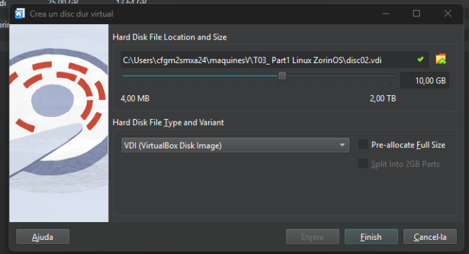
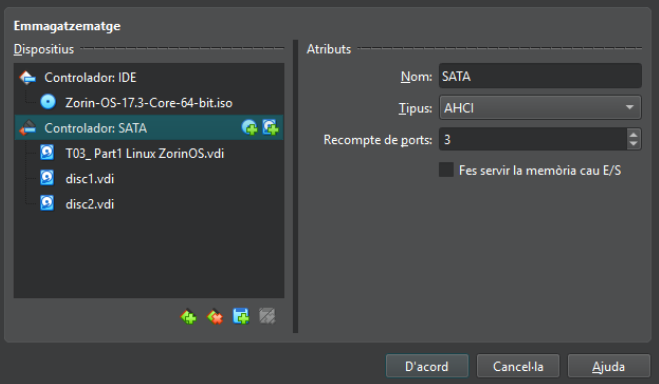

Acte seguit, hem obert la màquina virtual i comprovar amb la següent comanda fdisk -l que la maquina hagi detectat els dos discos creats anteriorment.

Amb aquesta comanda, hem pogut verificar que el sistema detecta els 2 discos creats. Gràcies a això tindrem un bon emmagatzematge per a utilitzar la nostra màquina.

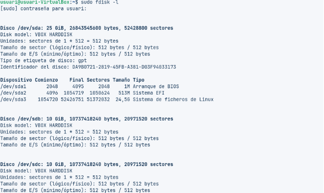

---

## 1. Configuració inicial d’un grup de volum (VG) i un volum logic (LV)

A continuació hem creat els volums físics amb la comanda sudo pvcreate. Tot i que per poder executar-la haurem de tenir instal·lada l’eina “lvm2”, per instal·lar-la executarem la comanda: sudo apt install lvm2

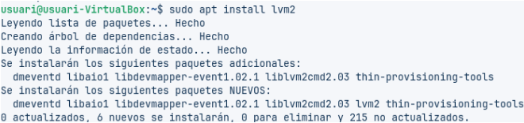
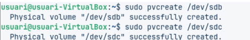

Ara crearem un grup de volums i els assignarem als dos discs, amb la comanda vgcreate

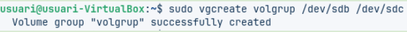

Posteriorment podem crear o eliminar volums
⦁	Afegir volums: vgextend [nom del vg] [disc] /// vgextend volgrup /dev/sdd

Amb la comanda vgdisplay podem veure els grups creats i les seves característiques.

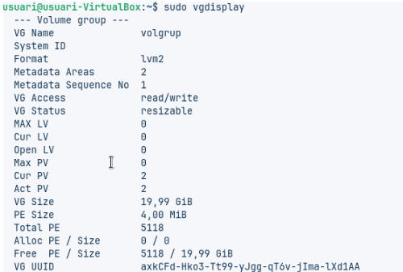

Per crear un volum lògic l’haurem de crear indicant la mida, el VG i el nom amb el qual volem crear-lo.
lvcreate -L [Mida] -n [Nom del Volum Lògic] [Nom del Grup] /// lvcreate -L 200M -n lv01 volgrup

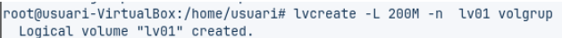

Cada volum lògic és com una partició del disc, per tant caldrà muntar-lo correctamente perquè sigui funcional, per això haurem de crear una carpeta per poder muntar el volum dins el sistema d’arxius de la màquina.
Primer, haurem de crear la carpeta on volem muntar-lo: mkdir /mnt/lv01
seguidament muntarem el volum a el sistema de fichers: mkfs.ext4 /dev/volgrup/lv01

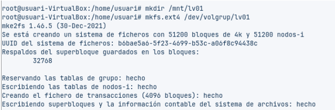

Ara ja tindriem el volum “inicialitzat”, però per poder utilitzar-lo usarem la comanda mount, per muntar el volum a la carpeta que hem creat.
mount /dev/volgrup/lv01 /mnt/lv01/

Ara ja hauriem muntat el volum a la carpeta creada, però cada cop que iniciem la màquina s’hauria de tornar a “asignar” aquest volum a la carpeta, per fer-ho permanent haurem d’editar l’arxiu /etc/fstab → nano /etc/fstab

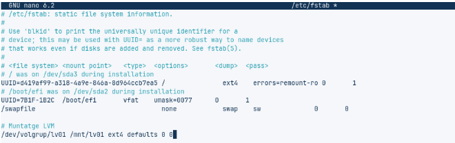

Els camps de la línia que hem utilitzat tenen el següent significat:

⦁	/dev/volgrup/lv01: unitat que es vol muntar.
⦁	/mnt/lv01: punt de muntatge
⦁	ext4: per indicar el sistema de fitxers utilitzat.
⦁	defaults: les opcions de muntatge per defecte. Aquí
es podria indicar si és només lectura, etc.
⦁	dump: 0 per indicar que el sistema de fitxers no
s'hagi de bolcar. Avui dia és la conf. normal.
⦁	pass: 0 per indicar que no es faran comprovacions
d'aquest volum a l'arrancar el sistema.

Si volem modificar el tamany d’un volum lògic (LV) usarem normalment aquestes dues comandes:
⦁	lvextend: només serveix per estendre el volum
⦁	lvreduce: permet reduir la mida
Tmbé podem usar la comanda lvresize

IMPORTANT, sempre que volguem modificar un LV, haurem de desmuntar-lo perque no estigui en ús.

---

## 2. Creació d’un mirall (lvm_mirror)

Per crear un mirall simple del nostre Volum lògic haurem de fer servir la comanda lvcreate
lvcreate -L 90M -m1 -n mirror1v volgrup

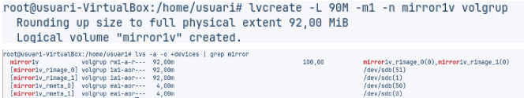

El sistema de mirall ja estaria creat.

## 3. Creació d’un snapshot del nostre volum lògic

Ara crearem un snapshot o còpia del nostre LV, per fer-ho primer crearem alguns archius dins el nostre LV, ho farem amb la comanda touch:

touch /mnt/lv01/file01
touch /mnt/lv01/file02
touch /mnt/lv01/file03

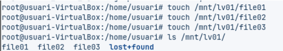

Seguidament crearem la instantània (snapshot) amb la comanda lvcreate

lvcreate -L 100M -s -n copialv01 /dev/volgrup/lv01

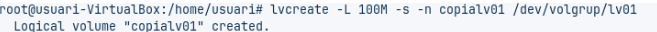

En aquesta comanda usem -s per indicar que es un snapshot.

Per veure els LV que tenim creats i com la còpia apunta al original usarem la comanda:
lvs volgrup

Si volem veure el contingut que té aquesta còpia muntarem el LV per poder veure el contingut que té dins. Per fer-ho crearem una nova carpeta i seguidament muntarem el volum a aquesta
mkdir /mnt/copia
mount /dev/volgrup/copialv01 /mnt/copia

Ara podem veure el contingut que té dins amb la comanda ls /mnt/copia

Ara ja tindrem creada la snapshot.
