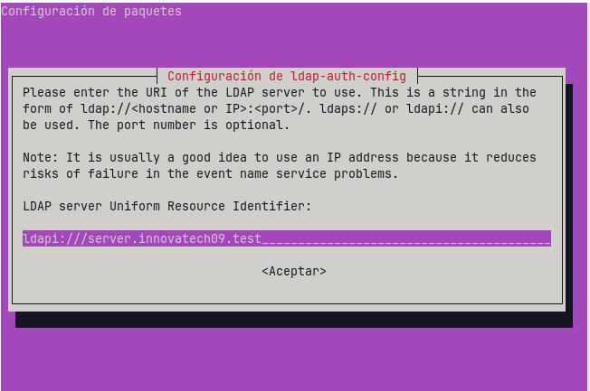

# Configuració de la Màquina Virtual

Per configurar la màquina virtual, he assignat **4096 MB de RAM**:

 <br><br><br>

## Configuració de Xarxa

- **Primer adaptador:** Xarxa NAT  
  

- **Segon adaptador:** Adaptador de només l’amfitrió  
  <br><br><br>

## Configuració de Netplan

Entrarem a l’arxiu `/etc/netplan/50-cloud-init.yaml` amb `sudo nano` i posarem la següent configuració:

<br><br><br>

## Configuració del Domini

Per configurar el domini, obrirem l’arxiu `/etc/hosts` amb `sudo nano` i modificarem el domini que està després del `127.0.1.1`:

  
  
<br><br><br><br><br><br><br><br><br>


# Instal·lació i Configuració d’OpenLDAP

Per instal·lar OpenLDAP, primer ens posem com a **root** amb:

```bash
sudo su
```
Després, instal·lem OpenLDAP i les utilitats necessàries:
```bash
apt install slapd ldap-utils -y
```


Durant la instal·lació, apareixerà aquesta finestra per introduir la contrasenya de l’usuari administrador:


Per verificar que el servei està funcionant correctament:
```bash
systemctl status slapd
```
<br><br><br>

## Configuració del Domini

Per configurar el domini, executem:
```bash
sudo su
dpkg-reconfigure slapd
```


Per comprovar que la configuració s’ha aplicat correctament:
```bash
slapcat
```
<br><br><br><br><br><br><br><br><br>


# LDAP Account Manager (LAM)

## 1. Instal·lació

Primer, instal·lem el paquet del gestor **LDAP Account Manager**:


Per accedir a LAM, obrim el navegador i escrivim:
http://la nostra IP/lam


Això ens portarà a la pàgina principal on podrem iniciar sessió:

<br><br><br>

---

## 2. Configuració inicial de LAM

Abans d’iniciar sessió, hem de configurar LAM:

1. Anem a la part superior dreta i fem clic a **"Configuració de LAM"**.
2. Seleccionem **"Editar perfils del servidor"**:

.png)  


### Configuració del directori

Dins **"Preferències del servidor"**, introduïm la configuració indicada:


### Ajustos d’eines

A l’apartat **"Ajustos d’eines"**, apliquem la configuració mostrada:


### Configuració d’usuaris i grups

Seguim la configuració indicada a la imatge:


Un cop fet això, ja podem iniciar sessió:


> La primera vegada que accedim, el sistema ens demanarà permís per crear les unitats organitzatives (OU) d’usuaris i grups:

<br><br><br>

---

## 3. Creació de grups

1. Anem al menú superior i seleccionem **"Comptes" > "Grups"**.
2. Fem clic a **"Crear grup"** i introduïm la informació desitjada:

  
  
<br><br><br>

---

## 4. Creació d’usuaris

1. Anem al menú superior i seleccionem **"Comptes" > "Usuaris"**.
2. Fem clic a **"Crear usuari"** i introduïm la informació necessària:

  
  
<br><br><br>

---

## 5. Assignar contrasenya

Per assignar una contrasenya als usuaris:

1. Anem a **"Establir contrasenya"**.
2. Introduïm la contrasenya que vulguem:

<br><br><br><br><br><br><br><br><br>

# INTEGRACIÓ CLIENT
Primer de tot entrerem en el directori de /etc/hosts amb sudo nano i en la IP 127.0.1.1 posarem el domini del client i en la IP del nostre servidor, es a dir, la IP 192.168.56.101 posarem el domini del servidor


Per comprobar-ho posarem la comanda de hostname -f i ens ahuria de sortir el domini del client q hem posat abans y si posem dig(domini del servidor) ens ahuria de sortir informacio sobre aquesta.


Ara instal.larem moduls per utilitza libmap i nss, per això escriurem la comanda de  apt install libnss-ldap libpam-ldap ldap-utils nscd -y, y despres seguirem els pasos de la instal.lacvió




Ara ho comprobarem amb ldapsearch, aixo amb la comanda de ldapsearch -x -D 'cn=admin,dc=innovatech09,dc=test' -W -H ldap://server.waytoit.test -b 'dc=innovatech09,dc=test' objectClass=posixAccount uid 


Ara configurarem el archiu nsswitch.conf, per aixo entrem al directori de /etc/nsswitch.conf amb sudo nano i afagirem el ldap a les tres primeres lineas.


Ara editerem el archiu de /etc/pam.d/common-password i eliminarem la linia del terme use_authtok


Ara editerem el archiu de /etc/pam.d/common-session i afegim una linea per crear els perfils


Ara reiniciarem el servei amb systemctl restart ncsd i comprovarem que veu els usuaris amb getent passwd | tail


Ara entrarem al archiu de /etc/pam.d/gdm-launch-environment i afegirem la primera linea


