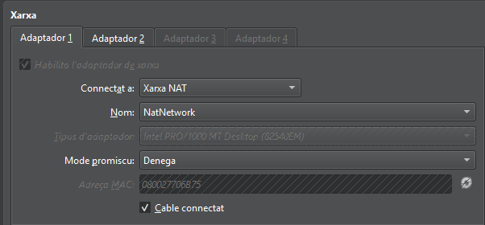
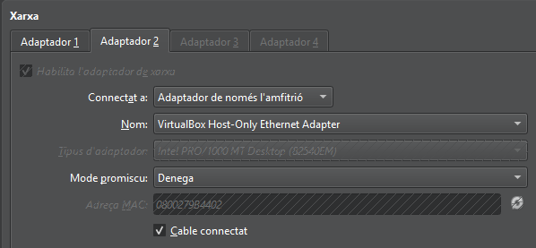

# CONFIGURACIÓ MAQUINA  
Per configurar la màquina virtual he posat 4096MB de RAM  

En el primer Adaptador he posat xarxa NAT  

I en el segon adaptador he posat Adaptador de només l’amfitrió  

Entrerem al arxiu de /etc/netplan/50-cloud-init-yaml amb sudo nano y posarem aquesta configuració  

Ara configurarem el domini, per fer això obrirem el arxiu de /etc/hosts amb sudo nano, dintre del arxiu cambiarem el domini que està després del 127.0.1.1  

# INSTAL.LACIÓ I CONFIGURACIÓ D’OPENLDAP  

Per instal·lar OpenLDAP, primer ens hem de posar com a root amb sudo su, i després l’hem d’instal·lar amb la comanda apt install slapd ldap-utils -y.  

Un cop hem posat això, ens sortirà aquesta finestra, on haurem d’introduir la contrasenya.  

Un cop instal·lat, comprovem que el servei està funcionant amb la comanda systemctl status slapd.  

Per configurar el domini, entrarem com a root amb la comanda sudo su i després executarem la comanda dpkg-reconfigure slapd.  

I per comprovar-ho, executarem la comanda slapcat mentre estem com a root.  

# LDAP UTILS
Primer obrirem el crearem i obrirem el archiu de OU_users.ldif amb sudo nano

Dintre del archiu escriurem aquest text

Aqui posarem la comanda de ldapadd -D "cn=admin,dc=innovatech09,dc=test" -W -f OU_users.ldif, aquesta ordre serveix per importar l’arxiu .ldif al directori LDAP utilitzant l’usuari administrador (cn=admin). El paràmetre -W fa que el sistema ens demani la contrasenya abans de continuar.

Aqui posarem la comanda de ldapsearch -xLLL -b "dc=innovatech09,dc=test" uid=* sn givenName mail, aquesta comanda fa una cerca dins del directori LDAP i mostra els camps uid, sn, givenName i mail dels usuaris existents per assegurar-nos que la informació s’ha carregat correctament.

# LDAP ACCOUNT MANAGER
Primer de tot instal.larem el paquet del gestor LDAP account manager

