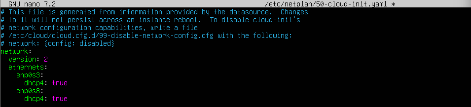
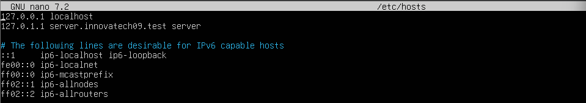
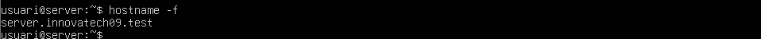
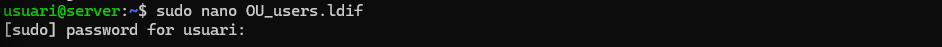
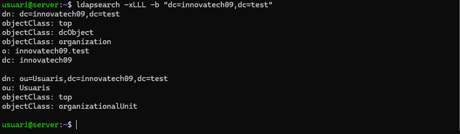

# CONFIGURACIÓ MAQUINA  
Per configurar la màquina virtual he posat 4096MB de RAM  

En el primer Adaptador he posat xarxa NAT  

I en el segon adaptador he posat Adaptador de només l’amfitrió  

Entrerem al arxiu de /etc/netplan/50-cloud-init-yaml amb sudo nano y posarem aquesta configuració  

Ara configurarem el domini, per fer això obrirem el arxiu de /etc/hosts amb sudo nano, dintre del arxiu cambiarem el domini que està després del 127.0.1.1  

# INSTAL.LACIÓ I CONFIGURACIÓ D’OPENLDAP  

Per instal·lar OpenLDAP, primer ens hem de posar com a root amb sudo su, i després l’hem d’instal·lar amb la comanda apt install slapd ldap-utils -y.  

Un cop hem posat això, ens sortirà aquesta finestra, on haurem d’introduir la contrasenya.  

Un cop instal·lat, comprovem que el servei està funcionant amb la comanda systemctl status slapd.  

Per configurar el domini, entrarem com a root amb la comanda sudo su i després executarem la comanda dpkg-reconfigure slapd.  

I per comprovar-ho, executarem la comanda slapcat mentre estem com a root.  

# LDAP UTILS
Es mostra un terminal on s’executa la comanda:
sudo nano OU_users.ldif
El sistema demana la contrasenya de l’usuari per obrir el fitxer LDIF amb privilegis de superusuari. Aquest fitxer contindrà la definició de la unitat organitzativa (OU) per LDAP.

Comanda executada:
ldapadd -D "cn=admin,dc=innovatech09,dc=test" -W -f OU_users.ldif
Es demana la contrasenya LDAP i es confirma l’addició de la nova entrada:
"ou=Usuaris,dc=innovatech09,dc=test"
Aquest pas afegeix la unitat organitzativa definida al fitxer LDIF dins del directori LDAP.

Comanda executada:
ldapsearch -xLLL -b "dc=innovatech09,dc=test"
Resultat:
- Mostra l’estructura del domini LDAP.
- Inclou el DN principal (dc=innovatech09,dc=test) i la unitat organitzativa (ou=Usuaris).
- Es llisten les classes d’objecte: top, dcObject, organization i organizationalUnit.
Aquesta comanda verifica que la OU s’ha creat correctament.

Contingut del fitxer OU_users.ldif en l’editor nano:
dn: ou=Usuaris,dc=innovatech09,dc=test
ou: Usuaris
objectClass: top
objectClass: organizationalUnit
Aquest fitxer defineix la unitat organitzativa "Usuaris" dins del domini LDAP.

