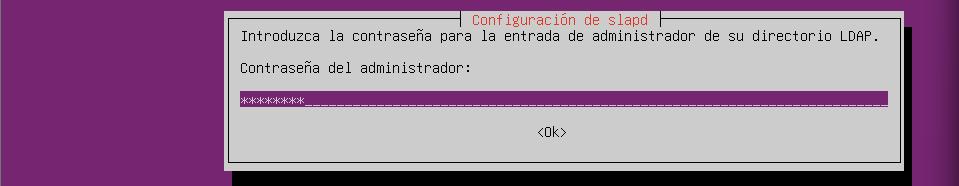

# Configuració de la Màquina Virtual

Per configurar la màquina virtual, he assignat **4096 MB de RAM**:

 <br><br><br>

## Configuració de Xarxa

- **Primer adaptador:** Xarxa NAT  
  

- **Segon adaptador:** Adaptador de només l’amfitrió  
  <br><br><br>

## Configuració de Netplan

Entrarem a l’arxiu `/etc/netplan/50-cloud-init.yaml` amb `sudo nano` i posarem la següent configuració:

<br><br><br>

## Configuració del Domini

Per configurar el domini, obrirem l’arxiu `/etc/hosts` amb `sudo nano` i modificarem el domini que està després del `127.0.1.1`:

  
  
<br><br><br><br><br><br><br><br><br>


# Instal·lació i Configuració d’OpenLDAP

Per instal·lar OpenLDAP, primer ens posem com a **root** amb:

```bash
sudo su
```
Després, instal·lem OpenLDAP i les utilitats necessàries:
```bash
apt install slapd ldap-utils -y
```


Durant la instal·lació, apareixerà aquesta finestra per introduir la contrasenya de l’usuari administrador:



Per verificar que el servei està funcionant correctament:
```bash
systemctl status slapd
```
<br><br><br>

## Configuració del Domini

Per configurar el domini, executem:
```bash
sudo su
dpkg-reconfigure slapd
```


Per comprovar que la configuració s’ha aplicat correctament:
```bash
slapcat
```
<br><br><br><br><br><br><br><br><br>


# LDAP Account Manager (LAM)

## 1. Instal·lació

Primer, instal·lem el paquet del gestor **LDAP Account Manager**:


Per accedir a LAM, obrim el navegador i escrivim:
http://la nostra IP/lam


Això ens portarà a la pàgina principal on podrem iniciar sessió:

<br><br><br>

---

## 2. Configuració inicial de LAM

Abans d’iniciar sessió, hem de configurar LAM:

1. Anem a la part superior dreta i fem clic a **"Configuració de LAM"**.
2. Seleccionem **"Editar perfils del servidor"**:

.png)  


### Configuració del directori

Dins **"Preferències del servidor"**, introduïm la configuració indicada:


### Ajustos d’eines

A l’apartat **"Ajustos d’eines"**, apliquem la configuració mostrada:


### Configuració d’usuaris i grups

Seguim la configuració indicada a la imatge:


Un cop fet això, ja podem iniciar sessió:


> La primera vegada que accedim, el sistema ens demanarà permís per crear les unitats organitzatives (OU) d’usuaris i grups:

<br><br><br>

---

## 3. Creació de grups

1. Anem al menú superior i seleccionem **"Comptes" > "Grups"**.
2. Fem clic a **"Crear grup"** i introduïm la informació desitjada:

  
  
<br><br><br>

---

## 4. Creació d’usuaris

1. Anem al menú superior i seleccionem **"Comptes" > "Usuaris"**.
2. Fem clic a **"Crear usuari"** i introduïm la informació necessària:

  
  
<br><br><br>

---

## 5. Assignar contrasenya

Per assignar una contrasenya als usuaris:

1. Anem a **"Establir contrasenya"**.
2. Introduïm la contrasenya que vulguem:

<br><br><br><br><br><br><br><br><br>

# INTEGRACIÓ CLIENT
### Editar el fitxer `/etc/hosts`

Primer, entrem al directori i editem el fitxer:

```bash
sudo nano /etc/hosts
```

A la IP 127.0.1.1, escrivim el domini del client.

A la IP del servidor (192.168.56.101), escrivim el domini del servidor.


### Comprovació de configuració del domini

Per verificar que tot funciona correctament:

```bash
hostname -f
```

Aquesta comanda hauria de mostrar el domini del client que hem afegit.

Després comprovem el domini del servidor amb:

```bash
dig (domini_del_servidor)
```

Ens hauria d’aparèixer informació relacionada amb aquest domini.


### Instal·lació dels mòduls LDAP

Ara instal·larem els paquets necessaris per utilitzar libpam i nss:

```bash
sudo apt install libnss-ldap libpam-ldap ldap-utils nscd -y
```

Seguidament, seguim els passos que apareixeran durant la instal·lació.


### Comprovació amb ldapsearch

Fem una prova per comprovar la connexió amb el servidor LDAP:

```bash
ldapsearch -x -D 'cn=admin,dc=innovatech09,dc=test' -W -H ldap://server.waytoit.test -b 'dc=innovatech09,dc=test' objectClass=posixAccount uid
```


### Configuració del fitxer nsswitch.conf

Editem el fitxer:

```bash
sudo nano /etc/nsswitch.conf
```
Afegim ldap a les tres primeres línies corresponents (passwd, group, shadow).


### Edició del fitxer common-password

Obrim el fitxer següent:

```bash
sudo nano /etc/pam.d/common-password
```

Eliminem la línia que contingui el terme use_authtok.


### Edició del fitxer common-session

Ara editem:

```bash
sudo nano /etc/pam.d/common-session
```

Afegim una línia per crear automàticament els perfils dels usuaris.


### Reinici del servei i comprovació d’usuaris

Reiniciem el servei:

```bash
sudo systemctl restart nscd
```

Després comprovem si detecta els usuaris LDAP:

```bash
getent passwd | tail
```


### Edició del fitxer gdm-launch-environment

Finalment, obrim:

```bash
sudo nano /etc/pam.d/gdm-launch-environment
```

I afegim la primera línia necessària per la configuració.


### Prova d'accès final

Iniciem sessió amb la conta que vem crear amb el account manager LAM


I per saber la creació automàtica de la carpeta personal posarem:

```bash
id
```
