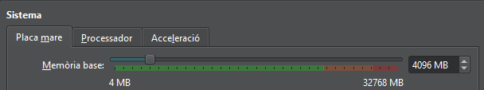

# Configuració de la Màquina Virtual

Per començar la instal·lació i configuració del servidor, hem de preparar correctament la màquina virtual. En aquest cas, he assignat 4096 MB de RAM per assegurar un rendiment estable durant el funcionament dels serveis LDAP i LAM. Aquesta quantitat de memòria és suficient per a entorns de prova o petites implementacions.

 <br><br><br>

## Configuració de Xarxa

- Per permetre la comunicació entre el servidor i els clients, configurarem dos adaptadors de xarxa:
Primer adaptador: configurat en Xarxa NAT, permet que la màquina virtual tingui accés a Internet per descarregar paquets i actualitzacions.
  

- Segon adaptador: configurat com a Adaptador de només l’amfitrió (Host-Only Adapter), permet la comunicació directa entre la màquina host i la màquina virtual, sense passar per Internet. Això és útil per a proves de connexió LDAP i accés des de clients locals.
  <br><br><br>

## Configuració de Netplan

Un cop configurada la xarxa virtual, cal definir la configuració IP dins del sistema operatiu de la màquina virtual.

Accedim a l’arxiu de configuració de xarxa amb:

```bash
sudo nano /etc/netplan/50-cloud-init.yaml
```

Allà hi introduirem la configuració que estableix l’adreça IP estàtica, la passarel·la i els DNS corresponents. D’aquesta manera, el servidor sempre utilitzarà la mateixa IP dins de la xarxa host-only, evitant conflictes o canvis d’adreça.

<br><br><br>

## Configuració del Domini

Finalment, configurarem el domini local que identificarà el nostre servidor dins de la xarxa.

Obrim el fitxer /etc/hosts amb:
```bash
sudo nano /etc/hosts
```
A continuació, modifiquem la línia que comença amb 127.0.1.1, substituint el nom per defecte per un nom de domini personalitzat. Això permetrà identificar el servidor LDAP pel seu domini en lloc de la seva IP.

Per exemple, podem utilitzar:
```bash
127.0.1.1   server.innovatech09.test   server
```

  
  
<br><br><br><br><br><br><br><br><br>


# Instal·lació i Configuració d’OpenLDAP

Abans de començar, és recomanable actualitzar els repositoris del sistema per assegurar que descarreguem la versió més recent dels paquets:
```bash
sudo apt update && sudo apt upgrade -y
```

Després, ens situem com a usuari root per tenir tots els permisos necessaris durant la instal·lació:
```bash
sudo su
```

Instal·lem els paquets principals d’OpenLDAP i les seves utilitats de gestió:
```bash
apt install slapd ldap-utils -y
```


Durant el procés d’instal·lació, el sistema ens demanarà definir una contrasenya per a l’usuari administrador de LDAP (cn=admin). Aquesta contrasenya és essencial, ja que ens permetrà accedir posteriorment al directori per crear i modificar usuaris i grups.


Per verificar que el servei està funcionant correctament:
```bash
systemctl status slapd
```
<br><br><br>

## Configuració del Domini

Per configurar el domini, executem:
```bash
sudo su
dpkg-reconfigure slapd
```


Un cop finalitzat el procés, el servei s’actualitzarà automàticament amb la nova configuració del domini.

Per comprovar que el directori LDAP s’ha creat correctament, executem:
```bash
slapcat
```
Això confirma que el domini s’ha aplicat correctament i que el servei està preparat per gestionar usuaris i grups.
<br><br><br><br><br><br><br><br><br>


# LDAP Account Manager (LAM)

## 1. Instal·lació

Primer, instal·lem el paquet del gestor **LDAP Account Manager**:
```bash
sudo apt install ldap-account-manager -y
```


Per accedir a LAM, obrim el navegador i escrivim:
http://la nostra IP/lam


Això ens portarà a la pàgina principal on podrem iniciar sessió:

<br><br><br>

---

## 2. Configuració inicial de LAM

Abans d’iniciar sessió com a administrador LDAP, hem de configurar els paràmetres del servidor dins de LAM.

- A la part superior dreta, fem clic a “Configuració de LAM”.

- A continuació, seleccionem “Editar perfils del servidor” per obrir la configuració del nostre entorn LDAP.

.png)  


### Configuració del directori

A l’apartat “Preferències del servidor”, indiquem la informació del nostre servidor LDAP.
Cal especificar:

- Servidor LDAP: per exemple, ldap://server.innovatech09.test

- Base DN: dc=innovatech09,dc=test

- Usuari administrador (DN): cn=admin,dc=innovatech09,dc=test


### Ajustos d’eines

A continuació, a l’apartat “Ajustos d’eines”, configurem les opcions de comportament de LAM, com el llenguatge per defecte, els formats d’usuari i la manera en què es mostraran els grups i unitats organitzatives.


### Configuració d’usuaris i grups

Seguim la configuració indicada a la imatge:


Un cop fet això, ja podem iniciar sessió:


> La primera vegada que accedim, el sistema ens demanarà permís per crear les unitats organitzatives (OU) d’usuaris i grups:

<br><br><br>

---

## 3. Creació de grups

Un cop dins de LAM, podem començar a administrar el directori. El primer pas recomanat és crear els grups, ja que després podrem assignar-hi els usuaris.

- Al menú superior, seleccionem “Comptes” → “Grups”.

- Fem clic a “Crear grup” i introduïm la informació corresponent, com el nom del grup i el seu identificador únic (GID).

- Guardem els canvis i verifiquem que el grup aparegui correctament a la llista.

  
  
<br><br><br>

---

## 4. Creació d’usuaris

Després d’haver creat els grups, el següent pas és afegir els usuaris al directori LDAP. LAM permet fer-ho de manera visual, evitant l’ús directe de comandes LDAP i minimitzant errors en la configuració manual.

- Al menú superior, seleccionem “Comptes” → “Usuaris”.

- Fem clic a “Crear usuari” i omplim els camps obligatoris

  
  
<br><br><br>

---

## 5. Assignar contrasenya

Un cop creats els usuaris, el següent pas és establir la contrasenya per poder iniciar sessió i autenticar-se al directori LDAP.

- A LAM, anem al menú superior i seleccionem “Establir contrasenya”.

- Triem l’usuari al qual volem assignar la contrasenya i introduïm la contrasenya desitjada.

- Confirmem la contrasenya i guardem els canvis.

<br><br><br><br><br><br><br><br><br>

# INTEGRACIÓ CLIENT
### Editar el fitxer `/etc/hosts`

Obrim el fitxer amb permisos d’administrador:
```bash
sudo nano /etc/hosts
```

Afegim les següents línies:

127.0.1.1 → domini del client, per exemple client1.innovatech09.test.

192.168.56.101 → IP del servidor LDAP, amb el seu domini corresponent, per exemple server.innovatech09.test.

Aquesta configuració permet que el client resolgui el servidor per nom de domini i no només per IP, facilitant l’autenticació i la gestió centralitzada.


### Comprovació de configuració del domini

Per verificar que tot funciona correctament:

```bash
hostname -f
```

Aquesta comanda hauria de mostrar el domini del client que hem afegit.

Després comprovem el domini del servidor amb:

```bash
dig (domini_del_servidor)
```

Ens hauria d’aparèixer informació relacionada amb aquest domini.


### Instal·lació dels mòduls LDAP

Ara instal·larem els paquets necessaris per utilitzar libpam i nss:

```bash
sudo apt install libnss-ldap libpam-ldap ldap-utils nscd -y
```

Seguidament, seguim els passos que apareixeran durant la instal·lació.


### Comprovació amb ldapsearch

Fem una prova per comprovar la connexió amb el servidor LDAP:

```bash
ldapsearch -x -D 'cn=admin,dc=innovatech09,dc=test' -W -H ldap://server.waytoit.test -b 'dc=innovatech09,dc=test' objectClass=posixAccount uid
```


### Configuració del fitxer nsswitch.conf

Editem el fitxer:

```bash
sudo nano /etc/nsswitch.conf
```
Afegim ldap a les tres primeres línies corresponents (passwd, group, shadow).


### Edició del fitxer common-password

Obrim el fitxer següent:

```bash
sudo nano /etc/pam.d/common-password
```

Eliminem la línia que contingui el terme use_authtok.


### Edició del fitxer common-session

Ara editem:

```bash
sudo nano /etc/pam.d/common-session
```

Afegim una línia per crear automàticament els perfils dels usuaris.


### Reinici del servei i comprovació d’usuaris

Reiniciem el servei:

```bash
sudo systemctl restart nscd
```

Després comprovem si detecta els usuaris LDAP:

```bash
getent passwd | tail
```


### Edició del fitxer gdm-launch-environment

Finalment, obrim:

```bash
sudo nano /etc/pam.d/gdm-launch-environment
```

I afegim la primera línia necessària per la configuració.


### Prova d'accès final

Iniciem sessió amb la conta que vem crear amb el account manager LAM


I per saber la creació automàtica de la carpeta personal posarem:

```bash
id
```


