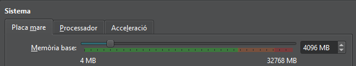
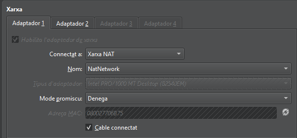
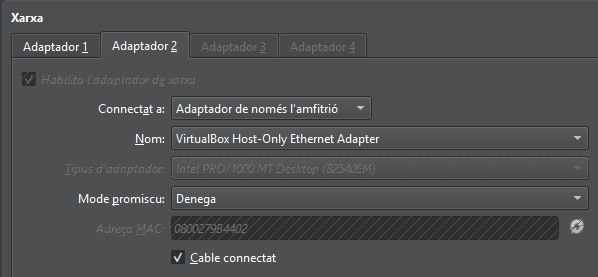
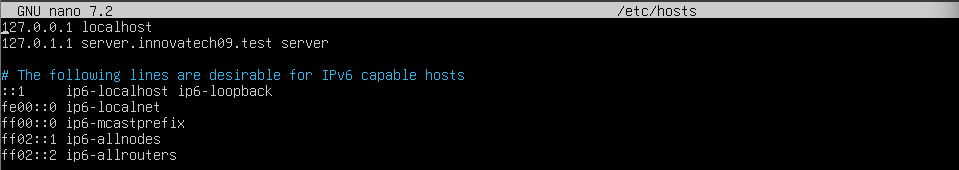
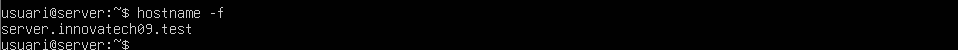

# Configuració de la Màquina Virtual

Per configurar la màquina virtual, he assignat **4096 MB de RAM**:

## Configuració de Xarxa

- **Primer adaptador:** Xarxa NAT  
  

- **Segon adaptador:** Adaptador de només l’amfitrió  
  

## Configuració de Netplan

Entrarem a l’arxiu `/etc/netplan/50-cloud-init.yaml` amb `sudo nano` i posarem la següent configuració:

## Configuració del Domini

Per configurar el domini, obrirem l’arxiu `/etc/hosts` amb `sudo nano` i modificarem el domini que està després del `127.0.1.1`:

  
  

