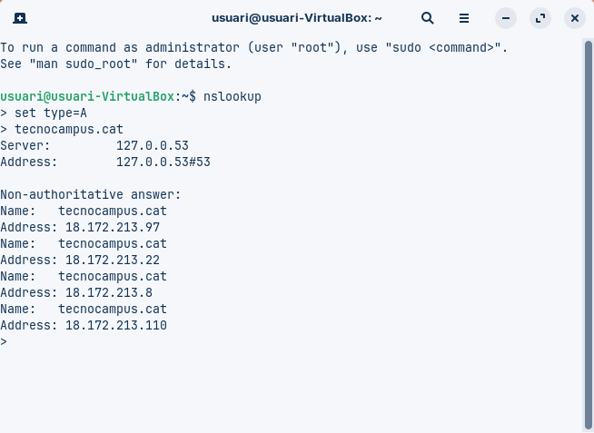

# Anàlisi de Consultes DNS

---

## Comanda 1: `dig xtec.cat A`

**Resultat:**  
No hi ha cap IP; la secció **ANSWER** està buida. L’estat és **NXDOMAIN**, que vol dir que el domini no existeix o no es pot trobar. El servidor que ha respost és `127.0.0.53` (DNS local). No hi ha **TTL** perquè no hi ha registre A.

**Explicació:**  
La consulta buscava l’adreça IP del domini `xtec.cat`. Com que no hi ha registre A, el sistema no pot donar cap IP. Pot ser que el domini no existeixi, estigui mal escrit o no tingui configurat un registre A.

**Conclusió:**  
No es pot obtenir la IP. El servidor local només diu que no es troba el domini.

---

## Comanda 2: `dig tecnocampus.cat NS`

**Resultat:**  
Servidors autoritatius:  
- `ns-1071.awsdns-05.org`  
- `ns-535.awsdns-02.net`  
- `ns-130.awsdns-16.com`  
- `ns-1689.awsdns-19.co.uk`  

Tots són d’**Amazon Web Services (AWS)**.

**Explicació:**  
Aquests servidors són els que tenen la informació oficial del domini `tecnocampus.cat`. Quan algú consulta el domini, aquests servidors responen amb la informació correcta.

**Conclusió:**  
Els servidors autoritatius controlen la informació del domini i garanteixen que sigui correcta.

---

## Comanda 3: `dig escolapia.cat SOA`

**Resultat:**  
- Correu de l’administrador: `root.dns1.nominalia.com`  
- Número de sèrie: `1761028965`  
- Servidor principal: `dns1.nominalia.com`

**Explicació:**  
El registre **SOA** mostra qui gestiona el domini i com s’actualitza. El correu indica el responsable tècnic i el número de sèrie mostra si s’han fet canvis recents.

**Conclusió:**  
El domini `escolapia.cat` està gestionat per **Nominalia**. Aquesta informació ajuda a sincronitzar correctament els servidors de DNS.

---

## Comanda 4: `dig -x 147.83.2.135`

**Resultat:**  
La IP té diversos noms:  
- `upc.cat`  
- `barcelonatech.upc.edu`  
- `www.upc.es`  
- `masters.upc.edu`  
- `saladeprensa.upc.edu`

**Explicació:**  
Aquesta consulta busca el nom del domini associat a una IP. Aquesta IP pertany a la **Universitat Politècnica de Catalunya (UPC)** i serveix per a diferents subdominis.

**Conclusió:**  
La IP no és d’un sol domini, sinó que s’usa per a diversos serveis de la UPC.

---

## Comanda 5: `nslookup -type=A wikipedia.org`

**Resultat:**  
- IP de Wikipedia: `185.15.58.224`  
- Resposta **no autoritativa**, ja que ve del servidor local (memòria cau).

**Explicació:**  
El resultat mostra la IP del domini, però no directament del servidor oficial. Prové d’un servidor intermedi que tenia la informació guardada. Això és normal i ràpid.

**Conclusió:**  
La IP serveix per connectar-se al lloc, però no és la font oficial.

---

## Comparativa de dominis

- `tecnocampus.cat` té diverses adreces IPv4: `18.172.213.97`, `18.172.213.22`, `18.172.213.8`, `18.172.213.110`. Té diversos servidors.  
- `wikipedia.org` té només una adreça IPv4: `185.15.58.224`.

