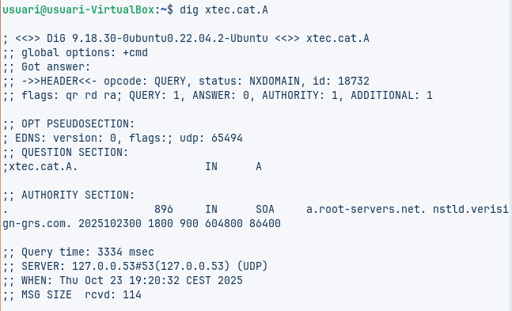
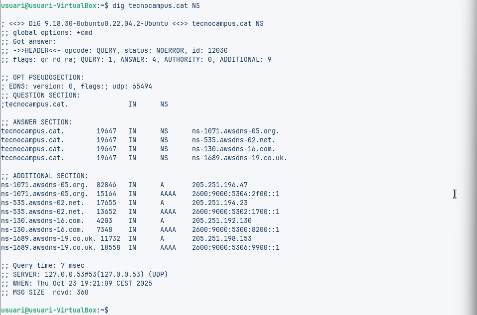
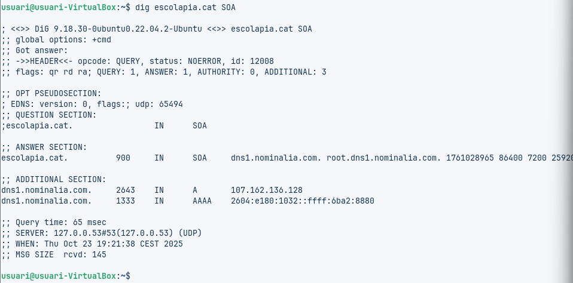
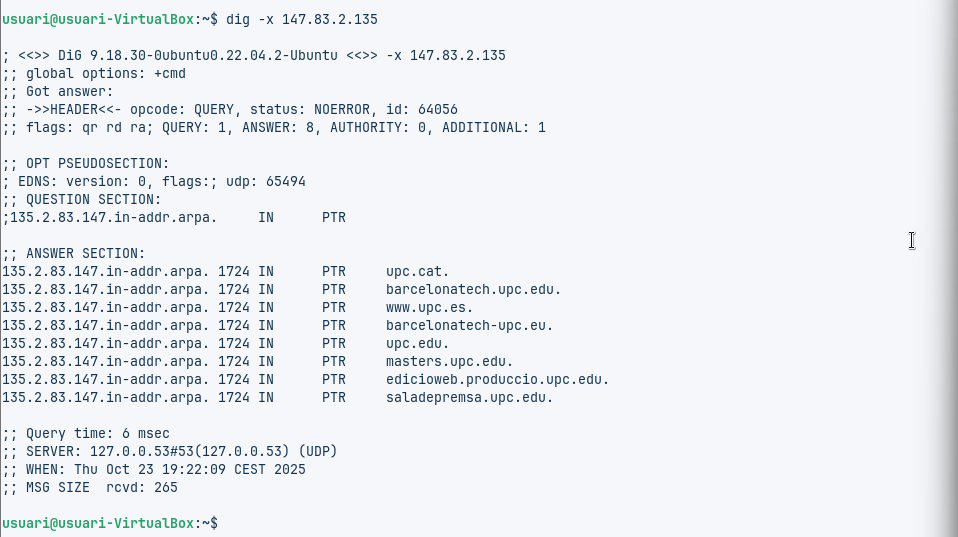
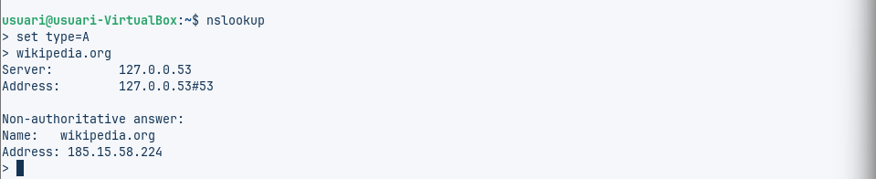

# Anàlisi de Consultes DNS

## Comanda 1: dig xtec.cat A
**Resultat observat:**  
No hi ha IP a la resposta, la secció ANSWER està buida. L’estat és NXDOMAIN, el que significa que el domini no es pot resoldre. El servidor que ha respost és 127.0.0.53 (DNS local). No apareix TTL perquè no hi ha registre A.

**Explicació:**  
Aquesta consulta buscava l’adreça IP del domini xtec.cat. Com que no hi ha un registre A, el sistema no pot donar una IP. Això pot ser perquè el domini no existeix, està mal escrit o no té configurat un registre A.

**Conclusió:**  
No es pot obtenir la IP, per això no apareix TTL. El servidor que ha donat la resposta és el DNS local de l’equip, que simplement indica que no es troba el domini.

---

## Comanda 2: dig tecnocampus.cat NS
**Resultat observat:**  
Servidors autoritatius:  
- ns-1071.awsdns-05.org  
- ns-535.awsdns-02.net  
- ns-130.awsdns-16.com  
- ns-1689.awsdns-19.co.uk  

Tots aquests servidors són d’Amazon Web Services (AWS).

**Explicació:**  
Aquests servidors contenen la informació oficial del domini tecnocampus.cat. Quan algú consulta aquest domini, aquests servidors responen amb la informació correcta. El fet que siguin d’AWS indica que el domini fa servir la infraestructura d’Amazon per al seu DNS.

**Conclusió:**  
Els servidors autoritatius són els responsables de gestionar les dades del domini i assegurar que la informació sigui precisa.

---

## Comanda 3: dig escolapia.cat SOA
**Resultat observat:**  
- Correu de l’administrador: root.dns1.nominalia.com  
- Número de sèrie: 1761028965  
- Servidor principal: dns1.nominalia.com

**Explicació:**  
El registre SOA indica qui administra el domini i com es controlen els canvis. El correu mostra el responsable tècnic, i el número de sèrie permet saber si s’han fet modificacions recents a la configuració del DNS.

**Conclusió:**  
El domini escolapia.cat està gestionat per Nominalia, i aquesta informació ajuda a mantenir la sincronització correcta entre servidors de DNS.

---

## Comanda 4: dig -x 147.83.2.135
**Resultat observat:**  
La IP està associada a diversos noms:  
- upc.cat  
- barcelonatech.upc.edu  
- www.upc.es  
- masters.upc.edu  
- saladeprensa.upc.edu

**Explicació:**  
Aquesta consulta inversa busca el nom de domini que correspon a una IP. Veiem que aquesta IP pertany a la Universitat Politècnica de Catalunya (UPC) i està vinculada a diversos subdominis.

**Conclusió:**  
La IP no pertany a un sol domini, sinó que s’usa per a diversos serveis dins de la UPC.

---

## Comanda 5: nslookup set type=A wikipedia.org
**Resultat observat:**  
- IP de Wikipedia: 185.15.58.224  
- Resposta no autoritativa, ja que prové de la memòria cau del servidor local.

**Explicació:**  
El resultat dóna la IP del domini, però no prové directament del servidor oficial, sinó d’un servidor intermedi que guardava la informació en memòria. Això és normal i ràpid, encara que no és la font original.

**Conclusió:**  
La resposta és vàlida per connectar-se al lloc, però no és oficial.

