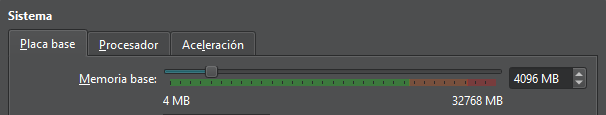
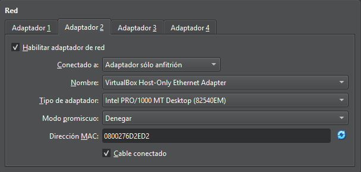

# T07: Instal·lant un servidor de noms 
---
## Configuració de la màquina virtual

Primer de tot he posat 4 GB de RAM

Despres he configurat els dos adaptadors, he deixat el primer en NAT i el segon le posat en adaptador pont

## Configuració de previes servidor
